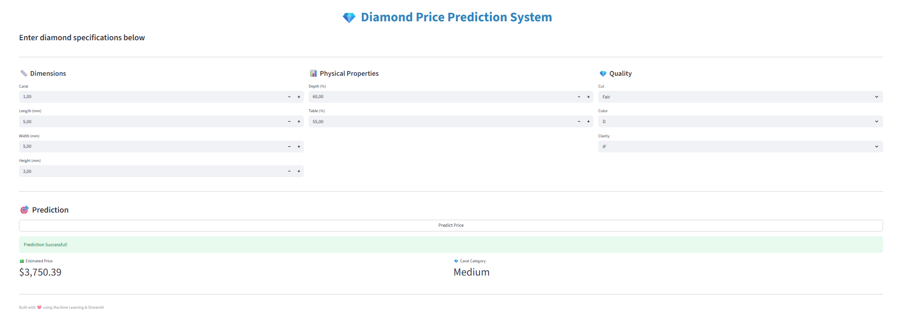

# 💎 Diamond Price Prediction & Analytics

## 📌 Project Overview

This project predicts the price of diamonds based on physical and quality attributes such as carat, cut, color, and clarity.

It uses Machine Learning (Random Forest) and is deployed as an interactive Streamlit web application.

---

## 🎯 Problem Statement

Diamond pricing depends on multiple complex factors.
This project builds a predictive model to:

* Estimate diamond prices
* Assist in pricing strategies
* Provide user-friendly prediction via web app

---

## 🚀 Features

* End-to-end ML pipeline (preprocessing + model)
* Feature engineering (volume, dimension ratio, carat category)
* Random Forest Regression model
* Interactive Streamlit UI
* Real-time predictions

---

## 🛠 Tech Stack

* Python
* Scikit-learn
* Pandas & NumPy
* Streamlit

---

## 📊 Model Details

* Algorithm: Random Forest Regressor
* Input Features:

  * carat, depth, table
  * x, y, z (dimensions)
  * cut, color, clarity
  * engineered features (volume, dimension ratio)

---

## 📸 Application Preview



---

## ⚙️ How to Run Locally

### 1. Clone repository

```bash id="clone1"
git clone https://github.com/YOUR_USERNAME/diamond-price-prediction.git
cd diamond-price-prediction
```

### 2. Install dependencies

```bash id="inst1"
pip install -r requirements.txt
```

### 3. Run application

```bash id="run1"
streamlit run app.py
```

---

## 💡 Key Learnings

* Data preprocessing & feature engineering
* Model building & evaluation
* Deployment using Streamlit
* Handling real-world ML pipeline issues

---

## 👨‍💻 Priyadharshini Ramakrishnan

Your Name
